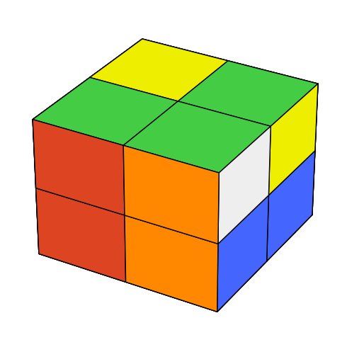
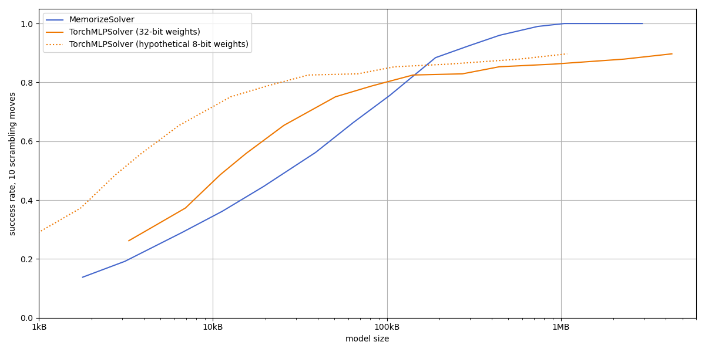
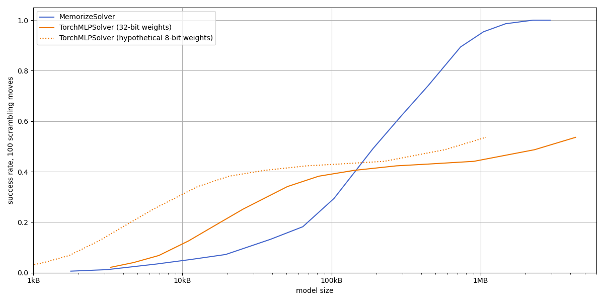

# Rubik

A playground for neural net-based Rubik's cube solvers

My motivation is to see if I can make a neural net-based solver smarter than memorizing
moves from a training dataset.

When I solve a cube manually, I do trials and errors, I return a few moves back when I see that
an approach does not lead to expected results. I use algorithms which move one more sticker into
position, swap corners in some desired way, etc. This approach likely doesn't produce the shortest
sequence of moves, but it was learnable for me, so it probably has a low Kolmogorov complexity
or something. It does not require memorizing millions of cube positions and moves, otherwise
I could not do it.

I would like to see machine learning develop a similar method.

To be clear, I don't expect my AI to learn solving algorithms from the internet, like I did.
It has to invent them all if it wants to use them.

I hear experiments like this were done before, but right now I am happy with pushing the boundaries
of *my own* understanding.

# Repository Contents

cubes.py contains Python models (1 model so far and counting) of Rubik's cubes and related puzzles.
Each model defines valid moves, recognizes whether the cube is solved, and so on. I.e., it
implements the problem and some simple analysis methods, but not the solution. Cube visualization
is there, too.

MoveSequence from sequences.py is a wrapper for a sequence of moves on a specific cube. It is used
to pass training and other data around.

solvers.py define a few methods to generate moves on a cube. RandomSolver, despite its name, is
meant to generate some kind of data rather than actually solve anything. MemorizeSolver remembers
the move it has seen after a specific cube position (using a dict, no neural net involved), and
regurgitates the move when it encounters the position again; It is meant to be a dumb reference
so that my first (also dumb) AI algorithms have something to compare to. The remaining solvers
(i.e., TorchMLPSolver) are the actual AI.

main.py is for high-level experiments and examples how to use stuff.

Tested with Python 3.9.15, PyTorch 1.13.1

# Thoughts on the Approach

## Smaller cube

The standard, 3×3×3 Rubik's cube allows
[4.3e19 positions](https://en.wikipedia.org/wiki/Rubik%27s_Cube#Permutations),
that is when rotations of the whole cube are not considered. This is way too much to fit into any
MemorizeSolver, and I suspect my first shots at a neural solver will not be much better.

Shrinking the solution space by limiting the number of moves used to scramble the cube seems
artificial (nothing prevents an imperfect solver from wandering away from the narrowed-down
solution space) and encouraging memorizing solvers (performing a multi-move algorithm
to do a minor improvement to the cube is exactly what takes the solver far away from known space).

Therefore, I picked a 2×2×2 cube, which only has 3,674,160 positions reachable by valid moves
(source: I counted them on my home computer), and after first 14 moves, there is nowhere else
to wander away to.

## Canonization

Given this is a toy problem, it seems worth further reducing its size while preserving structure,
if possible. It may shorten the feedback loop of solver development. It might also impair some
solvers, but probably not the simple ones I am going to start with.

I mentioned ignoring rotations of the whole cube. It seems reasonable not to force a solver to
learn 24 rotations of the same position separately (unless we want to see if the solver can spot
the symmetry on its own). Cube-solving algorithms generally do other things than rotate the whole
cube, and when these things are useful on an arbitrarily rotated cube, they should find the same
use on a cube with a preferred orientation.

Another symmetry to factor away are permutations of colors. Imagine you rotate a solved cube
before doing some scrambling moves; You get the same pattern of stickers as you would without the
initial rotation, except that what was blue is now yellow, etc. Swapping colors to make all these
positions identical before putting them into the solving algorithm can reduce the solution space
by another factor of nearly 24 (only "nearly" because a small part of the symmetry is already
solved by canonical rotation)

To remove one or both of these symmetries, I use rotations and/or color swaps to find the
"canonical" version of a given position. By canonical, I mean lexicographically smallest under
some pre-defined ordering of stickers and another ordering of colors. For rotational symmetry
only, it is also possible to make one corner fixed by disabling moves which move that corner,
but I am not sure how this plays together with color symmetry.

I decided not to implement mirror symmetry reduction. I am not sure how useful it would be, but
apparently it could not reduce the solution space by more than a half.

## Training

I am going to go with self-supervised learning, i.e., generating training data programatically;
Providing as little human-generated inputs as possible.

One approach I have encountered is to start with a solved cube, scramble it with a few moves,
then reverse the move sequence and interpret it as solving the cube from an initial scrambled
state. I see two drawbacks. While the first few moves from a solved position will likely make the
cube more and more scrambled, there comes a point where the solution starts to move more or
less randomly through the solution space. I don't want my trainig data contaminated with these
random moves, but I don't want to stop too early as that would leave a part of the space
unsampled. Second, I want my solver to learn algorithms, but I don't expect many algorihms
to be found in inverted sequences of random moves.

Another way would be to define (or train) an objective function on cube positions, then reward the
solver for achieving a higher-rated position. I am not sure how to define the objective manually;
As far as I know, more stickers in place do not necessarily mean that the cube is closer to solved,
but something like that might serve as a proxy. A machine learning-based objective can be trained
on the inverted scrambling moves (actually *must*, since I have no better data at this point).

The training algorithm should not discourage doing moves which do not lead to a "better" position
immediately. These moves may be needed for an algorithm, no matter what the objective function
thinks. This can also be interpreted as allowing the objective function to only recognize *some*
good positions, while a few also good, but unrecognized positions between them should not be
punished.

A partially trained solver can be used to generate training sequences, especially if it can
express a confidence level. Choose a move by random whenever the solver is not sure, then pick
those instances where a good position was reached by chance.

A solver can be trained on easy positions first (i.e., ones reachable by less scrambling moves?)
On a more difficult training instance, the solver may recognize an easier position once it is
reached, proceed to the full solution, and dispel doubts whether the preceeding moves were good.
If the solver works well enough on the easier instances, the objective might be as simple as
reaching the fully solved position, with no intermediate achievements to be rewarded.

# Results

## Memorizing vs. Simple Neural Nets

I tested MemorizeSolver and different sizes of TorchMLPSolver trained on inverse scrambling
sequences of 10 moves. For the TorchMLPSolver, I settled on four layers with three Swishes
between them, tested for different layer widths; Other multi-layer perceptron shapes seem to
perform similarly.

Plots below show the dependency of success rates (how often a model manages to solve a given cube
position within a limited number of moves -- 100 in this case) on model size. Two different plots
correspond to solving cubes scrambled by 10 and 100 moves.

Model sizes are not really comparable between the two model types, since one stores an arbitrary
representation of cube positions and moves (tuples of Python ints, one per square) while the other
has an arbitrary representation of weights (32-bit floats). To plot MemorizeSolver curves,
I recalculated this to a theoretically smallest representation of position-move pairs, which takes
around 25 bits (to distinguish 3,674,160 positions × 6 moves; This is not implemented, but it
could be). For TorchMLPSolver curves, I used the actual size of 32 bits per weight, and also a
speculative compression to 8 bits per weight without losing performance (not sure if possible).

A partially trained TorchMLPSolver seems to be a bit more efficient than a MemorizeSolver with
similar performace; E.g., a real TorchMLPSolver with 50% success rate on cubes scrambled by 10
moves takes about half the space of a theoretical MemorizeSolver with optimum rule representation.
Apparently, the neural net already does some compression. However, the trend reverses for more
thoroughly trained models. MemorizeSolver eventually approaches 100% success rate on all starting
positions (around 1 million memorized rules, 3MB), while TorchMLPSolver nearly stops improving
after 100k weights (400kB), and does not come close to 100% solved cubes even with a neural net
hundred times larger (40MB, not in the plot). This would be worse than MemorizeSolver even if
weights could be compressed to 8 bits.

I didn't get any further improvement with hyperparameter tuning (tried different numbers of
layers, different activations, optimizer params).

## Bootstrapped Training Data Generation

Coming soon

# License

My code is your code.

